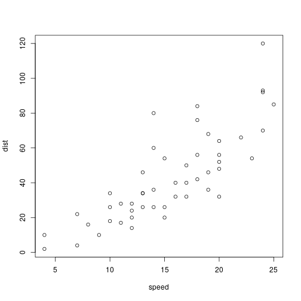

Docker Containers for Reproducible Research
========================================================
author: Vladimir Zhbanko
date: 14.05.2019
autosize: true

What is it?
=============================


Advantages
=============================

* Efficient
* Portability
* Reproducibility
* Automated

Disadvantages:
=============================
* Persistent Data Storage
* GUI
* Speed (if required)

Examples of Dockerfiles
=============================

* set up custom R-Studio IDE in a container https://github.com/vladdsm/docker-r-studio
* set up base R template https://github.com/vladdsm/docker-r-h2o
* example of adding R markdown https://github.com/vladdsm/docker-r-r
* example of running R script: https://github.com/vladdsm/docker-r-s

## Useful resources

Use r with docker general info ⇒ this is just amazing tutorial!!!
https://ropenscilabs.github.io/r-docker-tutorial/

Run R script in the docker container:
https://www.r-bloggers.com/running-your-r-script-in-docker/ 
========================================================

For more details on authoring R presentations please visit <https://support.rstudio.com/hc/en-us/articles/200486468>.

- Bullet 1
- Bullet 2
- Bullet 3

Slide With Code
========================================================


```r
summary(cars)
```

```
     speed           dist       
 Min.   : 4.0   Min.   :  2.00  
 1st Qu.:12.0   1st Qu.: 26.00  
 Median :15.0   Median : 36.00  
 Mean   :15.4   Mean   : 42.98  
 3rd Qu.:19.0   3rd Qu.: 56.00  
 Max.   :25.0   Max.   :120.00  
```

Slide With Plot
========================================================


